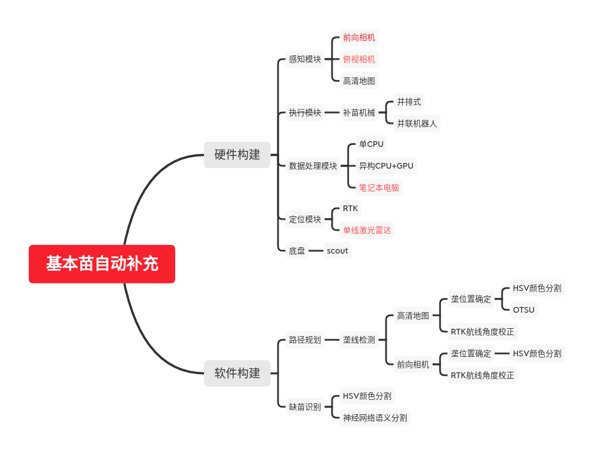

# README

## 基本苗补充

目录包括：

[doc](doc/README.md) - 存放相关文档内容

整体方案如下：

## 启动gazebo仿真环境：
roslaunch scout_bringup scout_base_gazebo_sim.launch

## 启动平滑滤波速度和键盘控制：
roslaunch scout_bringup scout_teleop_keyboard.launch

## 启动检测节点：
roslaunch visual_crop_row_navigation visualservoing.launch

## 启动速度控制器：
rosrun rqt_robot_steering rqt_robot_steering

